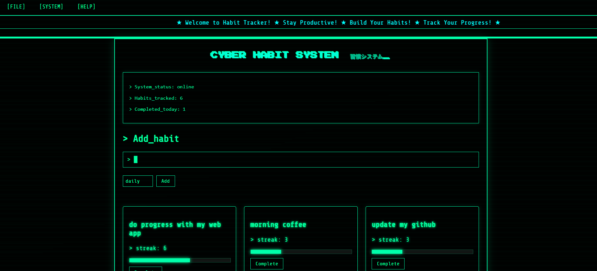

#  Cyber Habit Tracker

A minimalist retro-style habit tracking web app built with Flask.

Inspired by early 2000s terminal interfaces and cyber aesthetics, this project combines productivity with a unique visual identity.

---

##  Features

-  Create and delete habits
-  Track streaks automatically
-  Progress bars for each habit

---

## Preview


## 🚀 Tech Stack

- Python (Flask)
- SQLite (Flask-SQLAlchemy)
- HTML / CSS (custom retro UI)
- Jinja2 templating

---

## ⚙️ Installation

```bash
git clone https://github.com/your-username/cyber-habit-tracker.git
cd cyber-habit-tracker

pip install -r requirements.txt
python app.py
